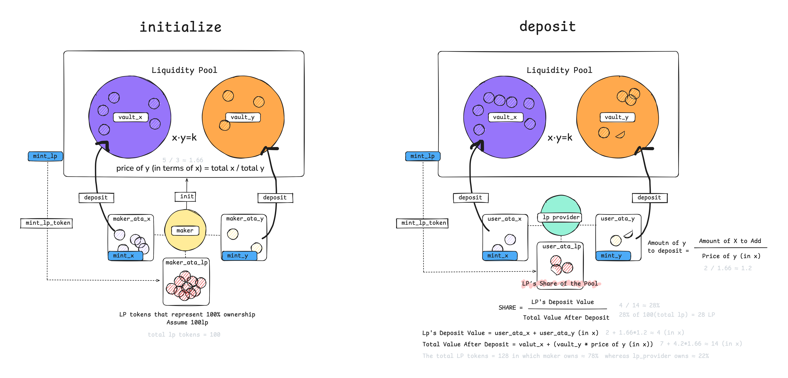

<!-- markdownlint-disable -->

# AMM (Automated Market Maker)

Automated Market Makers (AMMs) are decentralized exchange protocols that enable direct cryptocurrency trading without a traditional order book. Instead, they use liquidity pools and algorithms to determine asset prices, allowing trades to occur at any time. Users can contribute to these pools and earn fees in return.

## Instructions

- Initialize
  - The maker initializes the pool.
  - The maker deposits token_x and token_y into the pool.
  - The maker receives LP tokens representing their share of the pool.
  - accounts: `maker`, `mint_x`, `mint_y`, `mint_lp`, `value_x`, `value_y`, `maker_ata_x`, `maker_ata_y`, `maker_ata_lp`, `config`

**Disclaimer**: Please note that the values in this graph are not precise and are intended solely for illustrative purposes to aid in understanding the basic concepts. Additionally, the instructions may vary depending on the specific design of the AMM.

