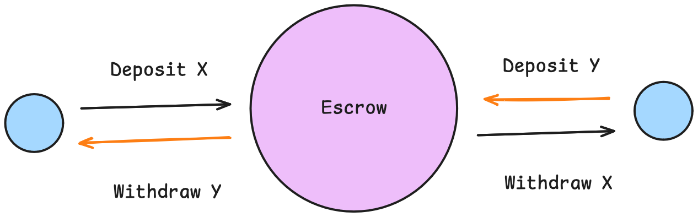
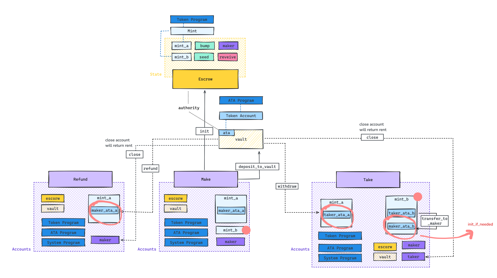

<!-- markdownlint-disable-->

# Escrow Program

##

The [escrow program](programs/escrow/src/lib.rs) facilitates a secure exchange of tokens based on predefined conditions between two parties:

- **Maker**: Initiates the transaction by creating an escrow account and making an initial deposit.

- **Taker**: Contributes by depositing an agreed amount into the established escrow account. In this case, the taker directly transfers the agreed amount to the maker associated token account for simplicity.

- **Maker/Taker**: Depending on the agreement's fulfillment, either party can close the vault account and withdraw the agreed-upon amount.

##

