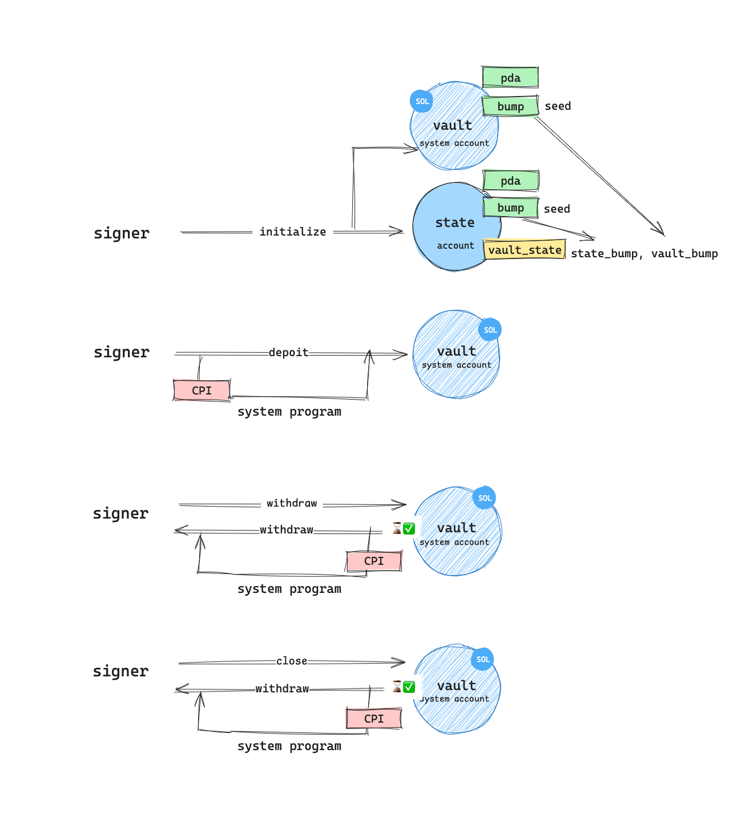

<!-- markdownlint-disable-->

# Vault Program

The [vault program](programs/vault/src/lib.rs) enables users to manage their SOL deposits.

- Create a vault account: This allows users to store their SOL tokens securely.

- Deposit SOL tokens: Users can transfer SOL tokens to their vault account for safekeeping.

- Withdraw SOL tokens: Users can retrieve their SOL tokens from the vault account after a locktime period.

- Close the vault account: Users can close their vault account and reclaim their SOL tokens.

The vault program introduces a locktime condition, ensuring that withdrawals and account closures respect this period. (For testing purposes, the locktime period is set to 10 seconds.)

<div align="center">
	
</div>

## Running Tests

1. Start Localnet: Ensure that a local Solana cluster is running.

```sh
solana-test-validator
```

2. Build the Program: Compile the Solana program.

```sh
anchor build
```

3. Deploy to Localnet: Deploy the program to the local network.

```sh
anchor deploy
```

4. Run Tests: Execute the tests using Anchor.

```sh
anchor test
```
