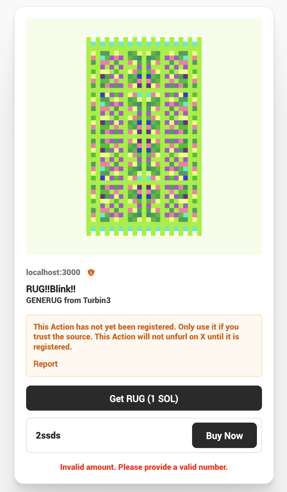
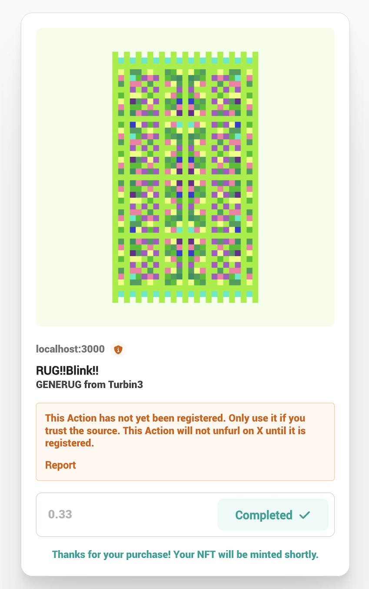
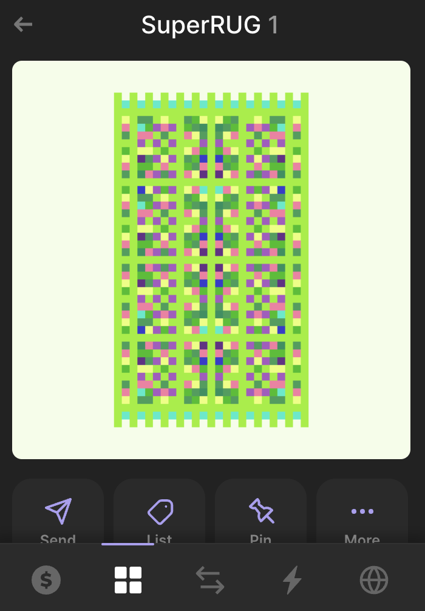

<!-- markdownlint-disable -->

## Features

- **Basic Input Validation**: Ensures user inputs are correct and valid.
- **NFT Minting and SOL Transfer**: Mints the RUG NFT and transfers the custom amount of SOL to the seller/creator.

### Links

- **Dial Devnet Testing Platform**: [Dial.to](https://dial.to/devnet)
- **Transaction Details**: [View on Solana Explorer](https://explorer.solana.com/tx/2LoSvbTTF7Ht6S4dVZGVBswCZvRfH1iagEPKBcFKDnXQ3gB5TjUaepcvtKP4nSxYGPoKkVDfd1XxToVsVGX2Nmv1?cluster=devnet)

	
	
	

****
